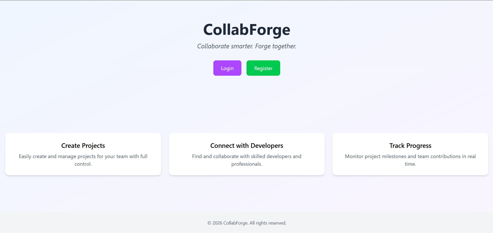
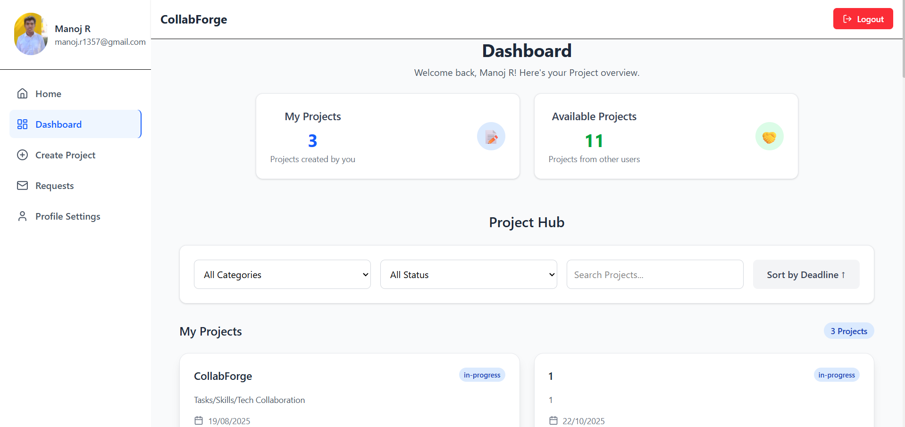
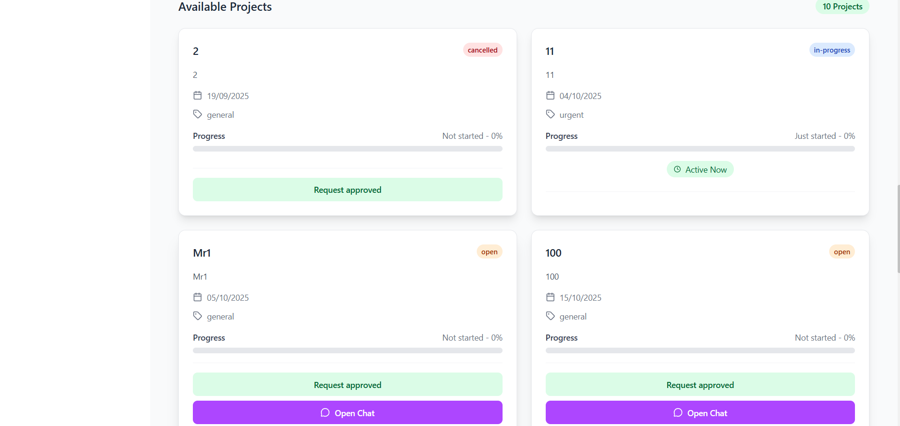
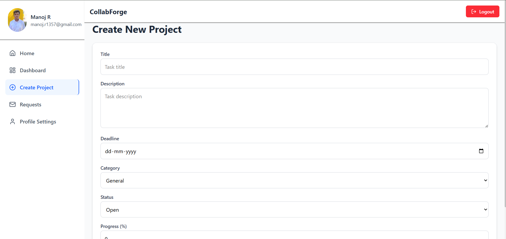
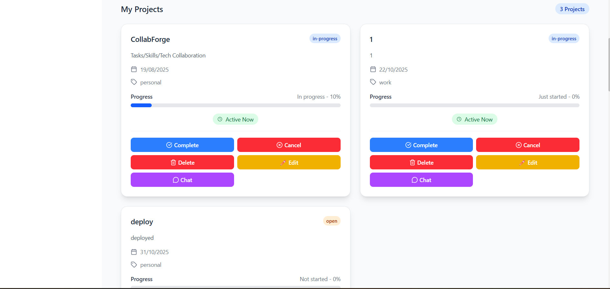
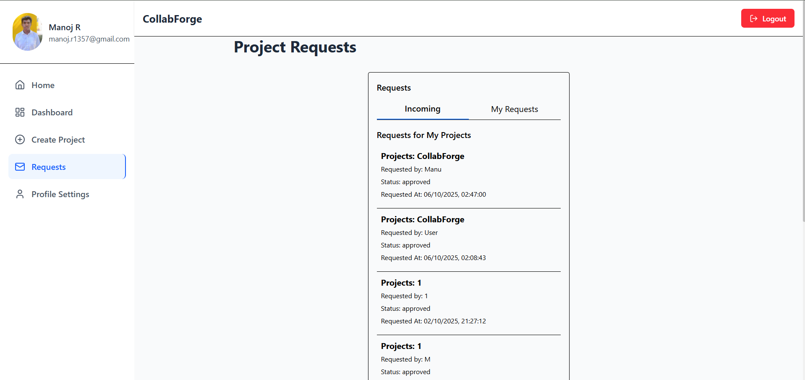
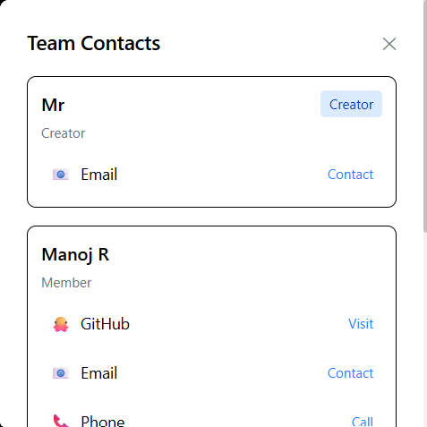
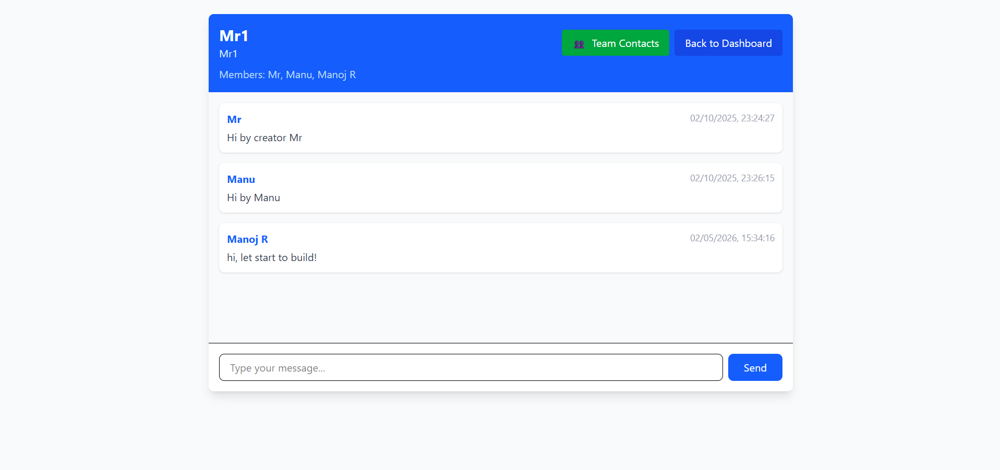

# 🚀 CollabForge

> **Collaborate smarter. Forge together.**

CollabForge is a web-based collaboration platform designed to connect clients and technology professionals for project-based work.

Users can create and manage projects, collaborate with team members, send and receive project requests, track progress, manage their profiles, and communicate through real-time task-based chat.

---

## ✨ Features

### 🔐 User Authentication
- User registration and login
- JWT-based authentication
- Protected application routes
- Secure password handling
- Profile management

### 📋 Project Management
- Create new projects
- Edit existing projects
- Delete projects
- Set project deadlines
- Categorize projects
- Track project status
- Monitor project progress

### 🤝 Collaboration & Requests
- Browse available projects
- Send collaboration requests
- Accept or reject requests
- Manage project team members
- View team contacts

### 💬 Real-Time Chat
- Task/project-based chat
- Real-time messaging using Socket.IO
- Messages stored in PostgreSQL
- Separate chat rooms for projects

### 👤 Profile Management
- Update username and bio
- Add areas of interest
- Upload profile pictures
- Manage contact information
- Control visibility of contact details
- Change password

### 📊 Dashboard
- View projects and activities
- Track ongoing projects
- Manage collaboration requests
- Access team information

### 📱 Responsive UI
- Clean and modern interface
- Responsive layout
- Desktop and mobile friendly
- Built with React and Tailwind CSS

---

## 🖥️ Screenshots

### 🏠 Home



### 📊 Dashboard



### 📋 Available Projects



### ➕ Create Project



### 📁 My Projects



### 🤝 Requests



### 👥 Team Contacts



### 💬 Real-Time Chat



---

## 🏗️ Project Architecture

```text
CollabForge
│
├── backend/
│   ├── config/
│   │   └── db.js
│   │
│   ├── middleware/
│   │   ├── authMiddleware.js
│   │   └── upload.js
│   │
│   ├── routes/
│   │   ├── authRoutes.js
│   │   ├── userRoutes.js
│   │   └── taskRoutes.js
│   │
│   ├── uploads/
│   ├── index.js
│   ├── package.json
│   └── .gitignore
│
├── frontend/
│   ├── public/
│   ├── src/
│   │   ├── components/
│   │   ├── pages/
│   │   ├── api.js
│   │   ├── socket.js
│   │   └── App.jsx
│   │
│   ├── package.json
│   └── .gitignore
│
├── screenshots/
│   ├── Home.png
│   ├── Dashboard.png
│   ├── AvailableProjects.png
│   ├── CreateProject.png
│   ├── MyProjects.png
│   ├── Requests.png
│   ├── TeamContacts.png
│   └── Chat.png
│
└── README.md
```

## 🛠️ Tech Stack
Frontend
React
Vite
Tailwind CSS
Axios
React Router
Framer Motion
Lucide React
Backend
Node.js
Express.js
Socket.IO
Multer
JWT
bcryptjs
Database
PostgreSQL
Neon PostgreSQL for production
Deployment
Frontend: Vercel
Backend: Render
Database: Neon
Development & Version Control
Git
GitHub
Visual Studio Code
## 🔄 Application Architecture
                   ┌─────────────────────┐
                   │       Browser       │
                   └──────────┬──────────┘
                              │
                              ▼
                   ┌─────────────────────┐
                   │       Vercel        │
                   │   React + Vite      │
                   └──────────┬──────────┘
                              │
                         REST API
                              │
                              ▼
                   ┌─────────────────────┐
                   │       Render        │
                   │ Node + Express      │
                   │      Socket.IO      │
                   └──────────┬──────────┘
                              │
                         PostgreSQL
                              │
                              ▼
                   ┌─────────────────────┐
                   │        Neon         │
                   │     PostgreSQL      │
                   └─────────────────────┘
## 🔑 Environment Variables

Environment variables are intentionally excluded from the repository.

Backend

Create:

backend/.env

Example:

PORT=5000

JWT_SECRET=your_jwt_secret

DB_USER=postgres
DB_PASSWORD=your_database_password
DB_HOST=localhost
DB_PORT=5433
DB_NAME=collabforge_db

For production, the backend uses:

DATABASE_URL=your_neon_database_connection_string

Never commit .env files or database credentials to GitHub.

Frontend

For local development:

VITE_API_BASE_URL=http://localhost:5000

For production:

VITE_API_BASE_URL=https://your-render-backend.onrender.com

Production environment variables should be configured through the Vercel project settings.

## 🚀 Local Development
1. Clone the repository
git clone https://github.com/ManojRTech/CollabForge.git
cd CollabForge
2. Backend Setup
cd backend
npm install

Create your .env file and configure your local PostgreSQL credentials.

Start the backend:

npm start

Backend runs on:

http://localhost:5000
3. Frontend Setup

Open another terminal:

cd frontend
npm install

Create:

.env.development

with:

VITE_API_BASE_URL=http://localhost:5000

Start the frontend:

npm run dev

Frontend runs on:

http://localhost:5173
## 🗄️ Database

CollabForge uses PostgreSQL for storing application data.

The database contains tables for areas such as:

Users
Tasks/Projects
Task Members
Requests
Task Requests
Chat Messages
Feedback

For production, the application connects to PostgreSQL through a Neon DATABASE_URL.

##🔌 API & Real-Time Communication

The frontend communicates with the backend through REST APIs.

Example:

Frontend
   ↓
Axios
   ↓
Express API
   ↓
PostgreSQL

Real-time project communication uses Socket.IO:

Client A
    │
    │ WebSocket
    ▼
Socket.IO Server
    │
    ├── Task Room
    │
    └── New Message
           │
           ▼
       Client B

Each project/task can have its own chat room so collaborators can communicate in real time.

## 🔒 Security

The project uses:

JWT authentication
Password hashing with bcrypt
Protected backend routes
Environment variables for sensitive configuration
CORS configuration
.gitignore rules for sensitive files

Sensitive credentials should never be committed to the repository.

## 📂 Repository Structure
Frontend
   ↓
React + Vite
   ↓
Axios / Socket.IO
   ↓
Backend
   ↓
Node.js + Express
   ↓
PostgreSQL
## 🌐 Deployment

The production deployment architecture is:

React + Vite
     │
     ▼
  Vercel
     │
     ▼
Node.js + Express + Socket.IO
     │
     ▼
   Render
     │
     ▼
PostgreSQL
     │
     ▼
    Neon
Production URLs

Frontend:

https://collab-forge.vercel.app

Backend:

https://collabforge-server.onrender.com

Production environment configuration is managed through Vercel and Render rather than committing environment files to GitHub.

##🔮 Future Enhancements

Potential improvements include:

🔔 Real-time notifications
📧 Email notifications
📈 Advanced project analytics
🔎 Improved project search and filtering
📁 Persistent cloud-based file storage
📝 Project activity history
👥 Enhanced team management
📊 User/project performance analytics
🔐 Additional authentication options
## 👨‍💻 Author

Manoj R

GitHub:
https://github.com/ManojRTech

## ⭐ Support

If you find this project useful, consider giving the repository a ⭐ on GitHub.
